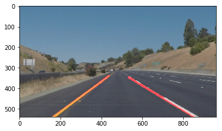
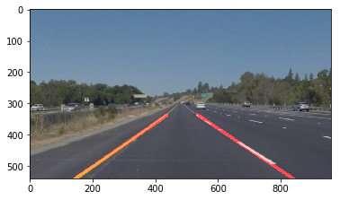
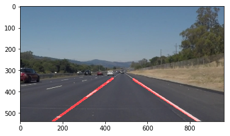
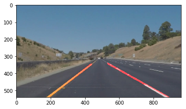

# **Finding Lane Lines on the Road** 

---

**Finding Lane Lines on the Road**

The goals / steps of this project are the following:
* Make a pipeline that finds lane lines on the road
* Reflect on your work in a written report

[//]: # (Image References)

[image1]: ./examples/grayscale.jpg "Grayscale"

---

### Reflection

### 1. Describe The pipeline. 

My pipeline was wrapped in a function called DrawThelane and consisted of 6 steps.

1. The first step I converted the images to grayscale.

2. after that I applied a gaussian blur transformation.

3. Then I transformed the grayscale images into the canny edges to detect the images edges. I chose 50 and 150 parameters that values were good to the images and the video.

4. I masked the picture with vertices $P_{1} = \left(\frac{length(x)}{16},length(y)\right)$ , $P_{2} = \left(\frac{length(x)}{2},\frac{length(y)}{2} \right)$ and $P_{3} = \left(length(x)-\frac{length(x)}{16},length(y) \right)$ forming a triangle that contains the lane.

5. I applied the hough lines transformation to detect the lane lines. After trying a lot of parameters I chose rho = 1, angle = pi/180, threshold = 50,min_line_len = 100 and max_line_gap=50, with this parameters I've got good results either in the videos and images.

6. The six step was to draw the lines with the draw_lines() function. The draw Lines function consists into split the hough lines by the slope. If the slope is less than 0 this should be the left lane instead if the slope is greater than zero this should be the right lane. Furthermore I saw that the left lines slopes are less than -0.6 and the right are greater than 0.6, then I selected only the the hough lines that are less than -0.6 and greater to 0.6.

  The next problem was in the video there were so many instant that the red line wasn't solid, to fixed this I did the next steps to each lane, the right and the left lane.
  
 1. I computed the average of all hough lines that passed the threshold used previously.
 
 2. I computed the equation of a line with the average points computed in the previous step.
 
 3. Extrapolated with the line equation to a point that intersect the x axis and the projection of the line.
 

 
In the next Pictures I'll Show some results

### 2. Identify potential shortcomings with your current pipeline

One potential shortcoming would be what would happen when the lane is cover by one shadow like the challenge video, in the challenge video my algorithm is not so good this happens because the hough lines are not well defined and for this reason the hough lines average are not well defined and this makes mistakes in the result.

Another shortcoming could be when the lane has a very big curve and the slope exceed the threshold, with my solution the lines won't detected

### 3. Suggest possible improvements to your pipeline

A possible improvement in the videos would be to create a prediction algorithm to use when the lines are not well defined, this means when the lines are not defined, the predicted algorithms will predict the most likely lines position. The algorithm could use the last pictures with lines well defined.

